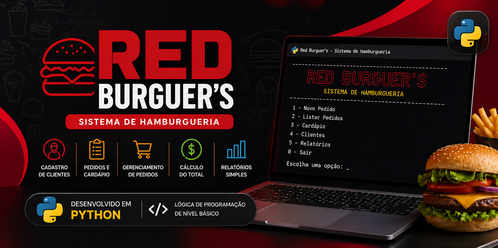

# Red Burguer's — Sistema de Hamburgueria

<p align="center">
  
</p>
> Sistema de Gestão de Hamburgueria — versão para terminal local

**Autora:** Emanuele Kmiecik 

---

## 📖 Sobre o Projeto

O **Red Burguer's** é um sistema interativo desenvolvido em Python que simula o funcionamento de uma hamburgueria, permitindo o gerenciamento completo do atendimento ao cliente.

O projeto foi criado com foco em aprendizado prático de lógica de programação e estruturação de sistemas.

---

## 🎯 Objetivo

Desenvolver um sistema capaz de:

- Cadastro de clientes  
- Exibição de cardápio  
- Realização de pedidos  
- Controle de estoque  
- Processamento de pagamento  
- Avaliação do atendimento  

---

## 🛠️ Tecnologias Utilizadas

| Tecnologia | Descrição |
|----------|--------|
| Python 3 | Linguagem principal |
| Random | Geração de vouchers |
| Pandas | Manipulação de dados (não utilizado) |
| NumPy | Operações numéricas (não utilizado) |
| Matplotlib | Visualização (não utilizado) |

---

## ⚙️ Funcionalidades

| Funcionalidade | Descrição |
|--------------|--------|
| Cadastro de Clientes | Armazena dados do usuário |
| Listagem | Exibe todos os clientes cadastrados |
| Cardápio | Produtos organizados por categorias |
| Pedido | Seleção de produtos e quantidades |
| Estoque | Atualização automática |
| Pagamento | Múltiplas formas com desconto |
| Promoções | Benefícios por valor de compra |
| Nota Fiscal | Resumo completo do pedido |
| Avaliação | Sistema de feedback com estrelas |

---

## 🍟 Estrutura do Cardápio

| Categoria | Itens |
|----------|------|
| Acompanhamentos | Batata rústica, anéis de cebola |
| Hambúrgueres | Cheeseburger, X-Bacon, Monstrão |
| Sobremesas | Brownie, Merengue |
| Bebidas | Refrigerante, Água |

---

## 💳 Regras de Negócio

- 💰 10% de desconto para pagamento à vista  
- 🎁 Compras acima de R$200 ganham sobremesa grátis  
- 📦 Estoque atualizado automaticamente  

---
## ▶️ Como Executar

```bash
git clone https://github.com/seu-usuario/red-burguers.git
cd red-burguers
python arquivo.py
```

---


## 🧠 Estrutura do Código

- Funções organizadas por responsabilidade  
- Uso de listas como armazenamento de dados  
- Estruturas condicionais (`if/elif`)  
- Laços de repetição (`while`)  
- Interface interativa em terminal  

---

## 📌 Diferenciais

- Interface com ASCII Art 🎨  
- Simulação completa de sistema real  
- Aplicação de regras de negócio  

---

## ⚠️ Limitações

- Não utiliza banco de dados  
- Dados não são persistidos  
- Bibliotecas importadas não utilizadas  

---

## 🚀 Melhorias Futuras

- Integração com banco de dados (MySQL/SQLite)  
- Interface gráfica (Tkinter/PyQt)  
- Persistência de dados  
- Dashboard com gráficos  
- Sistema de login  

---

## 👩‍💻 Autora

**Emanuele Kmiecik**

---

## 📄 Licença

Projeto para fins acadêmicos.
